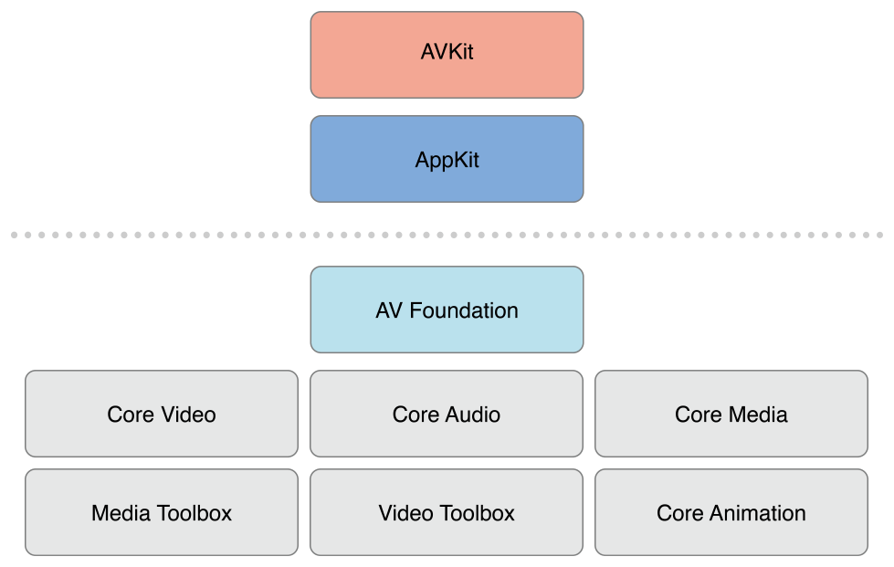

# 关于AVFoundation

> 重要提示: 本文档中包含的一些 API 或技术可能随时发生变化, 根据本文档开发实现的软件必须在终端操作系统上进行最终测试.

AVFoundation 是为数不多的几个媒体框架之一, 可以使用它来播放和创建基于时间的音视频资源. AVFoundation 提供的接口可以精确地处理基于时间的音视频媒体数据. 比如媒体文件的查找、创建、编辑甚至二次编码操作都可以使用 AVFoundation 框架完成. 也可以对从硬件设备获取到的实时视频输入流或者视频回放进行操作处理. 下图中展示了 iOS 上媒体框架的层次结构:

OS X 上媒体框架的层级结构图如下:

在完成具体的开发任务时, 你应该尽可能的选择更高层次的抽象框架.

* 如果只需要播放视频, 可以使用 AVKit 框架
* 如果需要在 iOS 设备上录制视频, 而且并不关心更具体的录制格式, 可以使用 UIKit 中 [UIImagePickerController](https://developer.apple.com/reference/uikit/uiimagepickercontroller) 类

需要注意的是, 在 AVFoundation 框架中使用的一些原始数据结构 \(包括时间相关的数据结构和存储描述媒体数据的底层对象\), 都在 Core Media 框架中声明.

## 概述 

AVFoundation 框架包含视频 API 和音频 API 两个方面. 旧的音频 API 在中 [_Multimedia Programming Guide_](https://developer.apple.com/library/prerelease/content/documentation/AudioVideo/Conceptual/MultimediaPG/Introduction/Introduction.html#//apple_ref/doc/uid/TP40009767) 进行了介绍, 可以更便捷的处理音频.

* 使用 [AVAudioPlayer](https://developer.apple.com/reference/avfoundation/avaudioplayer) 播放音频文件
* 使用 [AVAudioRecorder](https://developer.apple.com/reference/avfoundation/avaudiorecorder) 录制音频文件

你也可以使用 [Audio Session Programming Guide](https://developer.apple.com/library/prerelease/content/documentation/Audio/Conceptual/AudioSessionProgrammingGuide/Introduction/Introduction.html#//apple_ref/doc/uid/TP40007875) 中介绍的 [AVAudioSession](https://developer.apple.com/reference/avfoundation/avaudiosession) 来对音频进行详细配置.

### 媒体资源的表示和使用

AVFoundation 框架中使用 [AVAsset](https://developer.apple.com/reference/avfoundation/avasset) 类来表示一个媒体资源, AVFoundation 框架的设计很大程序上受到了这种表示方式的影响. 理解 [AVAsset](https://developer.apple.com/reference/avfoundation/avasset) 的结构和帮你更好的理解 AVFoundation 框架. 一个 AVAsset 实例是一个或多个音视频媒体数据的集合, 以一个整体的形式提供媒体资源的属性, 例如视频标题, 时长, 尺寸等等. AVAsset 是一个抽象类, 可以使用它的子类来从 URL 创建一个 asset 对象 \(参加 [Using Assets](https://developer.apple.com/library/prerelease/content/documentation/AudioVideo/Conceptual/AVFoundationPG/Articles/01_UsingAssets.html#//apple_ref/doc/uid/TP40010188-CH7-SW1)\), 或者根据已有的媒体资源创造出一个新的媒体资源 \(参加 [Editing](https://developer.apple.com/library/prerelease/content/documentation/AudioVideo/Conceptual/AVFoundationPG/Articles/00_Introduction.html#//apple_ref/doc/uid/TP40010188-CH1-SW1)\).

asset 中每个独立的媒体数据都有一个统一的类型: track. 一个 asset 中非常典型的情况是, 一个 track 代表音频, 另一个 track 则代表视频. 然而, 在比较复杂的情况下, 可能有多个同时包含音视频的 track.Assets 同时也可能包含元数据 \(译者注: 元数据可以视为对媒体内容的描述信息\).

AVFoundation 框架中一个十分重要的概念是, 初始化了一个 asset 或 track 并不意味着已经可以使用它们了. 即使只是资源的时长信息, 框架都可能需要进行一段时间的计算. 为了不阻塞主线程, 你可以在子线程中请求一个资源的相关信息, 并通过一个 block 回调异步地获得请求结果.

> 相关章节: [Using Assets](https://developer.apple.com/library/prerelease/content/documentation/AudioVideo/Conceptual/AVFoundationPG/Articles/01_UsingAssets.html#//apple_ref/doc/uid/TP40010188-CH7-SW1),[Time and Media Representations](https://developer.apple.com/library/prerelease/content/documentation/AudioVideo/Conceptual/AVFoundationPG/Articles/06_MediaRepresentations.html#//apple_ref/doc/uid/TP40010188-CH2-SW1)

### 回放

AVFoundation 允许开发者以更精确的方式来管理媒体资源的回放. 为了支持这一特性, AVFoundation 将资源的呈现状态 \(presentation state\) 和资源本身区分开. 这就能让开发者在同一时刻以不同分辨率呈现同一资源的两个不同片段. 一个媒体资源的呈现状态通过一个 _player item_ 对象进行管理, 而媒体资源中每个 track 的呈现状态通过一个 _player item track_ 对象进行管理. 比如, 使用 player item 和 player item tracks 可以设置资源的可视部分在播放时的尺寸, 设置 audio 的混音参数, 设置或禁用视频回放时的配置信息.

使用 _player_ 对象可以播放 player items 对象, 或者直接指定将其输出 \(output\) 到 Core Animation layer 之上. 还可以使用播放队列\(_player queue_\) 来顺序播放多个 player items 对象.

> 相关章节: [Playback](https://developer.apple.com/library/prerelease/content/documentation/AudioVideo/Conceptual/AVFoundationPG/Articles/02_Playback.html#//apple_ref/doc/uid/TP40010188-CH3-SW1)

### 资源的读取, 写入以及重新编码

AVFoundation 允许开发者通过多种方式创建一个新的资源. 比如对一个已存在的资源进行二次编码, 在 iOS 4.1 之后的版本中, 还可以操作一个资源的某些内容, 并将结果保存为一个新的资源.

你可以通过一个导出会话 \(_export session_\), 直接使用一些已经预设置好的常用格式 \(commonly-used presets\), 将一个已存在的资源进行重新编码. 如果需要更多的自定义设置, 则可以协同使用 _asset reader_ 和 _asset writer_ 对象对资源进行转换. 比如使用这两个对象你可以选择将哪些 track 输出到文件中, 自定义输出格式, 以及在转换过程中对资源进行修改.

如果要绘制可视化的音频波形图, 可以使用 asset reader 对象读取资源的音频轨道 \(track\).

> 相关章节: [Using Assets](https://developer.apple.com/library/prerelease/content/documentation/AudioVideo/Conceptual/AVFoundationPG/Articles/01_UsingAssets.html#//apple_ref/doc/uid/TP40010188-CH7-SW1)

### 缩略图

要创建一个视频的缩略图, 需要初始化一个 [AVAssetImageGenerator](https://developer.apple.com/reference/avfoundation/avassetimagegenerator) 对象. AVAssetImageGenerator 使用默认的视频轨道生成图片.

> 相关章节: [Using Assets](https://developer.apple.com/library/prerelease/content/documentation/AudioVideo/Conceptual/AVFoundationPG/Articles/01_UsingAssets.html#//apple_ref/doc/uid/TP40010188-CH7-SW1)

### 编辑

AVFoundation 通过组合器 \(_compositions_\)来从已存在的媒体片段 \(比如一个或多个音视频轨道\) 中创建新资源. 通过一个可变的组合器来新增或移除 track, 并调整它们的时间顺序. 你可以设置一个音频轨道的相对音量和渐变效果; 设置视频轨道的透明度或透明度渐变. 一个组合器是内存中一系列媒体片段的组装, 可以通过 _export session_ 将一个组合器导出到文件.

你还可以通过一个 _asset writer_ 对象来从媒体 \(比如一个简单的缓冲区或静态图像\) 中创建资源.

> 相关章节: [Editing](https://developer.apple.com/library/prerelease/content/documentation/AudioVideo/Conceptual/AVFoundationPG/Articles/03_Editing.html#//apple_ref/doc/uid/TP40010188-CH8-SW1)

### 静态图像及视频捕捉

捕捉会话 \(_capture session_\) 可以记录摄像头或者麦克风的输入信息. 一个捕捉会话协调设备的数据输入和输出 \(比如视频文件\). 可以在一个捕捉会话中配置多个输入和输出, 哪怕这个捕捉会话当前正处于运行状态. 通过向捕捉会话发送消息来开始或停止数据流.

> 相关章节: [Still and Video Media Capture](https://developer.apple.com/library/prerelease/content/documentation/AudioVideo/Conceptual/AVFoundationPG/Articles/04_MediaCapture.html#//apple_ref/doc/uid/TP40010188-CH5-SW2)

## AVFoundation中的并发编程 

AVFoundation 中的回调 \(block,KVO,notification\) 都不能保证会在特定的线程或队列中被调用. 相反, AVFoundation 会在任务执行对应的线程或队列中执行这些回调.

关于通知和线程有两个基本的准则:

* UI 相关的通知必须在主线程中发送
* 通知的发送和回调都会在同一个队列中执行

除了以上两个准则外\(例外情况参见引用文档\), 你不能假设一个通知会在某个特定的线程中执行. 如果你正在编写一个多线程的应用程序, 你可以使用 NSThread 类的 isMainThread 方法或者 \[\[NSThread currentThread\] isEqual:&lt;\#A stored thread reference\#&gt;\] 来判断当前是否是你所需要的线程. 你可以使用`performSelectorOnMainThread:withObject:waitUntilDone:` 或者`performSelector:onThread:withObject:waitUntilDone:modes:`方法来切换线程. 也可以使用 `dispatch_async`将回调 block 放到合适的线程中执行. 更多并发编程的资料参加 [_Concurrency Programming Guide._](https://developer.apple.com/library/prerelease/content/documentation/General/Conceptual/ConcurrencyProgrammingGuide/Introduction/Introduction.html#//apple_ref/doc/uid/TP40008091) 更多 block 相关资料参见 [_Blocks Programming Topics_](https://developer.apple.com/library/prerelease/content/documentation/Cocoa/Conceptual/Blocks/Articles/00_Introduction.html#//apple_ref/doc/uid/TP40007502). 示例代码 [_AVCam-iOS: Using AVFoundation to Capture Images and Movies_](https://developer.apple.com/library/prerelease/content/samplecode/AVCam/Introduction/Intro.html#//apple_ref/doc/uid/DTS40010112) 是 AVFoundation 的一个基础示例, 并展示了一些 AVFoundation 中线程和队列的用法.

## 前提条件 

AVFoundation 是一个成熟复杂的 Cocoa 框架. 为了能有效的使用这一框架, 你需要:

* 深刻理解 Cocao 开发工具和技术
* 掌握 block 的基本用法
* 理解 KVC 和 KVO 编程
* 对于回放, 还需要理解掌握 Core Animation\(参加 [_Core Animation Programming Guide_](https://developer.apple.com/library/prerelease/content/documentation/Cocoa/Conceptual/CoreAnimation_guide/Introduction/Introduction.html#//apple_ref/doc/uid/TP40004514), 简单的回放功能参见 [_AVKit Framework Reference_](https://developer.apple.com/reference/avkit)\)

## 参考资料 

下面是几个使用 AVFoundation 的例子, 其中两个是理解和实现摄像头捕捉功能的关键:

[_AVCam-iOS: Using AVFoundation to Capture Images and Movies_](https://developer.apple.com/library/prerelease/content/samplecode/AVCam/Introduction/Intro.html#//apple_ref/doc/uid/DTS40010112) 是任何使用相机功能程序的优秀示例. 这是一个完整的示例, 并且拥有良好的文档说明.

[_AVCamManual: Extending AVCam to Use Manual Capture API_](https://developer.apple.com/library/prerelease/content/samplecode/AVCamManual/Introduction/Intro.html#//apple_ref/doc/uid/TP40014578) 是 AVCam 的姊妹篇, 它实现了手动管理相机的功能.

[_RosyWriter_](https://developer.apple.com/library/prerelease/content/samplecode/RosyWriter/Introduction/Intro.html#//apple_ref/doc/uid/DTS40011110) 是一个实时处理帧数据的示例, 包含了视频的实时滤镜.

[_AVLocationPlayer: Using AVFoundation Metadata Reading APIs_](https://developer.apple.com/library/prerelease/content/samplecode/AVLocationPlayer/Introduction/Intro.html#//apple_ref/doc/uid/TP40014495) 是一个元数据 API 的使用示例.

