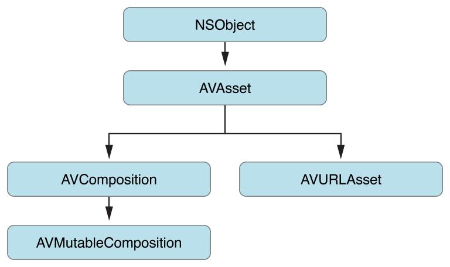

# 时间和媒体的表示

AV Foundation 框架中用 `AVAsset` 表示基于时间的视听数据, 比如电影文件或视频流. `AVAsset` 的结构决定了 AV Foundation 框架大部分的工作方式. AV Foundation 框架中使用的一些用来代表时间和媒体的底层数据结构来源于 Core Media 框架.

## Asset的表示 <a id="asset&#x7684;&#x8868;&#x793A;"></a>

[AVAsset](https://developer.apple.com/reference/avfoundation/avasset) 是 AV Foundation 框架的核心关键类, 它提供了对视听数据的格式无关的抽象. 类之间的关系如下图所示. 大部分情况下, 使用的都是这些类的子类: 使用 composition 的子类创建新的 asset, 使用`AVURLAsset`根据一个指定的 URL 创建 asset.



一个 asset 包含一组 track, 每个 track 都有特定媒体类型, 包括但不限于 audio, video, text, closed captions 以及 subtitles. Asset 对象提供整个资源的信息, 比如时长和标题. Asset 对象也可能包含元数据 \(metadata\), metadata 由 [AVMetadataItem](https://developer.apple.com/reference/avfoundation/avmetadataitem) 类表示.

如下图所示, 一个 track 由 [AVAssetTrack](https://developer.apple.com/reference/avfoundation/avassettrack) 类表示. 简单场景下, 一个 track 代表 audio component, 另一个 track 代表 video component; 复杂场景下, 可能有多个 audio 和 video 重叠的 track.


一个 track 包含多个属性, 比如类型 \(video or audio\), 视觉或听觉特性, 元数据, 以及时间轴 \(表现在其父 asset 中\). 此外, track 还包含一个描述格式的数组. 这个数组中的元素为`CMFormatDescription`对象 \(参见 [CMFormatDescriptionRef](https://developer.apple.com/reference/coremedia/cmformatdescriptionref)\), 用来描述 track 包含的媒体格式信息.

一个 track 可能被分为几段, 每一段由一个 [AVAssetTrackSegment](https://developer.apple.com/reference/avfoundation/avassettracksegment) 对象表示. 一个`AVAssetTrackSegment`对象就是一个由资源数据到 track 时间轴的映射.

## 时间的表示 <a id="&#x65F6;&#x95F4;&#x7684;&#x8868;&#x793A;"></a>

AV Foundation 框架中的时间由一个 Core Media 框架中的数据结构表示.

### 用 CMTime 表示一段时间

[CMTime](https://developer.apple.com/reference/coremedia/cmtime) 是一个以有理数表示时间的 C 语言结构体, 用一个`int64_t`类型作为分子, 一个`int32_t`类型作为分母. 从概念上来看, 时间段 \(timescale\) 描述了一秒中包含多少个时间单元. 如果 timescale 等于 4, 则每个时间单元代表四分之一秒; 果 timescale 等于 10, 则每个时间单元代表十分之一秒, 以此类推.

除了用来表示时间, `CMTime`还可以用来表示非数值的值: 正无穷大, 负无穷大, 不确定.

#### 使用 CMTime

使用方法 [CMTimeMake](https://developer.apple.com/reference/coremedia/1400785-cmtimemake) 或者 [CMTimeMakeWithSeconds](https://developer.apple.com/reference/coremedia/1400797-cmtimemakewithseconds) 创建一个时间.

```text
CMTime time1 = CMTimeMake(200, 2); // 200 half-seconds
CMTime time2 = CMTimeMake(400, 4); // 400 quarter-seconds

// time1 and time2 both represent 100 seconds, but using different timescales.
if (CMTimeCompare(time1, time2) == 0) {
    NSLog(@"time1 and time2 are the same");
}

Float64 float64Seconds = 200.0 / 3;
CMTime time3 = CMTimeMakeWithSeconds(float64Seconds , 3); // 66.66... third-seconds
time3 = CMTimeMultiply(time3, 3);
// time3 now represents 200 seconds; next subtract time1 (100 seconds).
time3 = CMTimeSubtract(time3, time1);
CMTimeShow(time3);

if (CMTIME_COMPARE_INLINE(time2, ==, time3)) {
    NSLog(@"time2 and time3 are the same");
}
```

更多详细信息参见 [_CMTime Reference_](https://developer.apple.com/reference/coremedia/1669288-cmtime).

#### CMTime 的特殊值

Core Media 框架提供了一些常量: `kCMTimeZero`, `kCMTimeInvalid`,`kCMTimePositiveInfinity` 和 `kCMTimeNegativeInfinity`. `CMTime`结构体能够进行很多操作, 比如要判断一个时间是否有效, 可以使用一些定义好的宏, 例如 [CMTIME\_IS\_INVALID](https://developer.apple.com/reference/coremedia/cmtime_is_invalid), [CMTIME\_IS\_POSITIVE\_INFINITY](https://developer.apple.com/reference/coremedia/cmtime_is_positive_infinity) 或者 [CMTIME\_IS\_INDEFINITE](https://developer.apple.com/reference/coremedia/cmtime_is_indefinite).

```text
CMTime myTime = <#Get a CMTime#>;
if (CMTIME_IS_INVALID(myTime)) {
    // Perhaps treat this as an error; display a suitable alert to the user.
}
```

不能将 CMTime 结构体与`kCMTimeZero`直接进行比较.

#### 将 CMTime 转换为对象

如果要在注释或者`Core Foundation`容器中使用 CMTime, 使用方法 [CMTimeCopyAsDictionary](https://developer.apple.com/reference/coremedia/1400845-cmtimecopyasdictionary) 和 [CMTimeMakeFromDictionary](https://developer.apple.com/reference/coremedia/1400819-cmtimemakefromdictionary) 可以在 CMTime 结构体和`CFDictionary`类型 \(参见 [CFDictionaryRef](https://developer.apple.com/reference/corefoundation/cfdictionaryref)\) 之间进行相互转换. 使用方法 [CMTimeCopyDescription](https://developer.apple.com/reference/coremedia/1400791-cmtimecopydescription) 可以获取 CMTime 结构体的字符串描述.

#### 循环次数 \(Epochs\)

`CMTime`结构体中的 epoch 通常被设置为 0. 但是你可以使用这个值来区分不同循环次数中的同一个时间点.

### 用 CMTimeRange 表示一个时间范围

[CMTimeRange](https://developer.apple.com/reference/coremedia/cmtimerange) 是一个 C 语言结构体, 包含两个`CMTime`类型的属性: 起始时间`start`和时长`duration`. 一个时间范围并不包含`start`加上`duration`得到的时间.

使用方法 [CMTimeRangeMake](https://developer.apple.com/reference/coremedia/1462785-cmtimerangemake) 和 [CMTimeRangeFromTimeToTime](https://developer.apple.com/reference/coremedia/1462817-cmtimerangefromtimetotime) 创建一个时间范围, 但是存在一些限制:

* `CMTimeRange`不能跨过`epoch`
* 只能对`start`的`epoch`值相同的 CMTimeRange 进行相互操作
* `duration`的`epoch`值应该一直为 0, `start`的`epoch`值为非负

### 处理 CMTimeRange

Core Media 框架提供了一个时间范围是否包含某个时间点或者其他时间范围的方法, 以及判断两个时间范围是否相同, 对两个时间范围进行交集和并集运算的方法. 例如, [CMTimeRangeContainsTime](https://developer.apple.com/reference/coremedia/1462775-cmtimerangecontainstime), [CMTimeRangeEqual](https://developer.apple.com/reference/coremedia/1462841-cmtimerangeequal), [CMTimeRangeContainsTimeRange](https://developer.apple.com/reference/coremedia/1462830-cmtimerangecontainstimerange) 和 [CMTimeRangeGetUnion](https://changjianfeishui.gitbooks.io/avfoundation-programming-guide/CMTimeRangeGetUnion).

注意下面的表达式永远返回 false:

```text
CMTimeRangeContainsTime(range, CMTimeRangeGetEnd(range))
```

更多相关的详细信息, 参见 [_CMTimeRange Reference_](https://developer.apple.com/reference/coremedia/1665980-cmtimerange).

#### CMTimeRange 的特殊值

Core Media 提供了一个表示空范围的常量和一个表示无效范围的常量: `kCMTimeRangeZero` 和 `kCMTimeRangeInvalid`. 可以使用以下这些宏对 CMTimeRange 的特殊值进行判断: [CMTIMERANGE\_IS\_VALID](https://developer.apple.com/reference/coremedia/cmtimerange_is_valid), [CMTIMERANGE\_IS\_INVALID](https://developer.apple.com/reference/coremedia/cmtimerange_is_invalid), [CMTIMERANGE\_IS\_EMPTY](https://developer.apple.com/reference/coremedia/cmtimerange_is_empty), [CMTIMERANGE\_IS\_EMPTY](https://developer.apple.com/reference/coremedia/cmtimerange_is_empty).

```text
CMTimeRange myTimeRange = <#Get a CMTimeRange#>;
if (CMTIMERANGE_IS_EMPTY(myTimeRange)) {
    // The time range is zero.
}
```

不能将 CMTimeRange 结构体与`kCMTimeRangeInvalid`直接进行比较.

#### 将 CMTimeRange 转换为对象

如果要在注释或者`Core Foundation`容器中使用 CMTimeRange, 使用方法 [CMTimeRangeCopyAsDictionary](https://developer.apple.com/reference/coremedia/1462781-cmtimerangecopyasdictionary) 和 [CMTimeRangeMakeFromDictionary](https://developer.apple.com/reference/coremedia/1462777-cmtimerangemakefromdictionary) 可以在 CMTimeRange 结构体和`CFDictionary`类型 \(参见 [CFDictionaryRef](https://developer.apple.com/reference/corefoundation/cfdictionaryref)\) 之间进行相互转换. 使用方法 [CMTimeRangeCopyDescription](https://developer.apple.com/reference/coremedia/1462823-cmtimerangecopydescription) 可以获取 CMTimeRange 结构体的字符串描述.

## 媒体的表示 <a id="&#x5A92;&#x4F53;&#x7684;&#x8868;&#x793A;"></a>

视频数据和与其相关联的元数据都使用 Core Media 框架中的对象类型来表示. Core Media 使用`CMSampleBuffer`\(参见 [CMSampleBufferRef](https://developer.apple.com/reference/coremedia/cmsamplebuffer)\) 类型表示视频数据. 一个`CMSampleBuffer`对象是一个包含了视频数据帧的 sample buffer, 用来作为 Core Video pixel buffer\(参见 [CVPixelBufferRef](https://developer.apple.com/reference/corevideo/cvpixelbufferref)\). 可以使用 [CMSampleBufferGetImageBuffer](https://developer.apple.com/reference/coremedia/1489236-cmsamplebuffergetimagebuffer) 方法访问 sample buffer 中的 pixel buffer.

```text
CVPixelBufferRef pixelBuffer = CMSampleBufferGetImageBuffer(<#A CMSampleBuffer#>);
```

可以在 pixel buffer 访问到实际的视频数据, 参见下文.

此外, 对于视频数据而言, 还可以视频帧其他方面的信息:

* **时间信息**: 使用 [CMSampleBufferGetPresentationTimeStamp](https://developer.apple.com/reference/coremedia/1489252-cmsamplebuffergetpresentationtim) 和 [CMSampleBufferGetDecodeTimeStamp](https://developer.apple.com/reference/coremedia/1489404-cmsamplebuffergetdecodetimestamp) 可以分别获取视频帧的初始时间和解码时间
* **格式信息**: 包含在一个`CMFormatDescription`对象中 \(参见 [CMFormatDescriptionRef](https://developer.apple.com/reference/coremedia/cmformatdescriptionref)\). 通过格式描述, 可以使用`CMVideoFormatDescriptionGetCodecType`获取视频的编码信息, 使用`CMVideoFormatDescriptionGetDimensions`获取视频尺寸
* **元数据**: 以附件形式存储在一个字典中, 通过 [CMGetAttachment](https://developer.apple.com/reference/coremedia/1470707-cmgetattachment) 获取:

  CMSampleBufferRef sampleBuffer = &lt;\#Get a sample buffer\#&gt;; CFDictionaryRef metadataDictionary =

  \`\`\` CMGetAttachment\(sampleBuffer, CFSTR\("MetadataDictionary", NULL\);

```text
    if (metadataDictionary) {
```

```text
  // Do something with the metadata.


```

}
```

## 将CMSampleBuffer转换为UIImage <a id="&#x5C06;cmsamplebuffer&#x8F6C;&#x6362;&#x4E3A;uiimage"></a>

下面的代码示例了如何将`CMSampleBuffer`转换为`UIImage`. 这个转换相当消耗性能, 使用时必须进行谨慎考虑.

​```text
- (UIImage *) imageFromSampleBuffer:(CMSampleBufferRef) sampleBuffer
{
    // Get a CMSampleBuffer's Core Video image buffer for the media data
    CVImageBufferRef imageBuffer = CMSampleBufferGetImageBuffer(sampleBuffer);
    // Lock the base address of the pixel buffer
    CVPixelBufferLockBaseAddress(imageBuffer, 0);

    // Get the number of bytes per row for the pixel buffer
    void *baseAddress = CVPixelBufferGetBaseAddress(imageBuffer);

    // Get the number of bytes per row for the pixel buffer
    size_t bytesPerRow = CVPixelBufferGetBytesPerRow(imageBuffer);
    // Get the pixel buffer width and height
    size_t width = CVPixelBufferGetWidth(imageBuffer);
    size_t height = CVPixelBufferGetHeight(imageBuffer);

    // Create a device-dependent RGB color space
    CGColorSpaceRef colorSpace = CGColorSpaceCreateDeviceRGB();

    // Create a bitmap graphics context with the sample buffer data
    CGContextRef context = CGBitmapContextCreate(baseAddress, width, height, 8,
      bytesPerRow, colorSpace, kCGBitmapByteOrder32Little | kCGImageAlphaPremultipliedFirst);
    // Create a Quartz image from the pixel data in the bitmap graphics context
    CGImageRef quartzImage = CGBitmapContextCreateImage(context);
    // Unlock the pixel buffer
    CVPixelBufferUnlockBaseAddress(imageBuffer,0);

    // Free up the context and color space
    CGContextRelease(context);
    CGColorSpaceRelease(colorSpace);

    // Create an image object from the Quartz image
    UIImage *image = [UIImage imageWithCGImage:quartzImage];

    // Release the Quartz image
    CGImageRelease(quartzImage);

    return (image);
}
```

